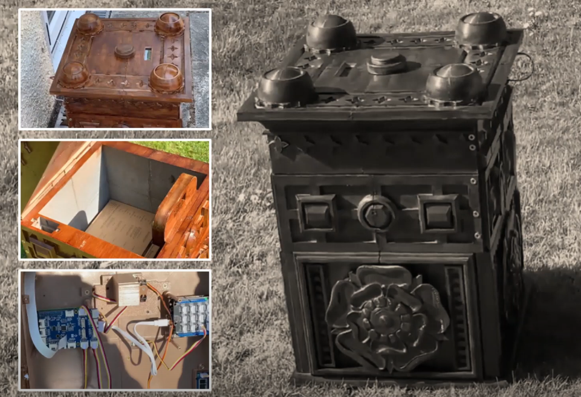

# IoT Parcel Box
The IoT Parcel Box is a 3D-printed smart box designed to securely receive and store deliveries even when the recipient is not present. It incorporates a lock controlled remotely through a React website and WebSockets, along with additional features such as temperature control. The box utilizes an Arduino and Raspberry Pi for managing the lock and other functionalities. Facial recognition powered by OpenCV is implemented to allow authorized individuals to access the box.

Click above image for youtube video of the box.

## Key Features
- Remote Lock Control: The lock mechanism of the parcel box can be controlled remotely through a React website, providing users with the ability to lock and unlock the box as needed.
- Delivery Management: The IoT Parcel Box enables users to receive deliveries even when they are not physically present. Delivery personnel can access the box to deposit packages securely.
- Temperature Control: The box includes temperature control features, allowing the user to regulate the internal temperature to protect temperature-sensitive items.
- Facial Recognition: Integrated facial recognition technology using OpenCV enables the parcel box to capture and store faces, allowing known individuals to access the box securely.

## Hardware Requirements
To set up the IoT Parcel Box, the following hardware components are required:
- 3D-Printed Box: The physical enclosure of the parcel box, which can be 3D-printed based on the provided design files.
- Arduino: The Arduino microcontroller is used for controlling the lock mechanism and communicating with the Raspberry Pi.
- Raspberry Pi: The Raspberry Pi serves as the central processing unit for the IoT Parcel Box, handling the web server, facial recognition, and communication with the Arduino.
- Lock Mechanism: A solenoid or servo motor-based lock mechanism is employed to secure the box.
- Temperature Control Module: An electronic module for monitoring and controlling the internal temperature of the box.
- Webcam: A webcam or camera module compatible with the Raspberry Pi for capturing images during facial recognition.

## Software Requirements
The following software components are required for the proper functioning of the IoT Parcel Box:
- React: The front-end interface for controlling the parcel box, implemented using React framework.
- Node-RED: A flow-based programming tool used for creating the logic and functionality of the IoT Parcel Box.
- OpenCV: A computer vision library utilized for facial recognition and face storage.
- Arduino IDE: The Arduino Integrated Development Environment is required to upload the firmware to the Arduino microcontroller.
- Python: The Raspberry Pi code is developed using Python programming language.